<!-- # 🧩 ShoppyGlobe Backend

This is the **backend API** for the ShoppyGlobe e-commerce application. It is built using **Node.js**, **Express**, and **MongoDB**. It provides RESTful endpoints for product management, user authentication, and shopping cart functionality.

---

## ⚙️ Tech Stack

- **Node.js**
- **Express.js**
- **MongoDB Atlas** with **Mongoose**
- **JWT Authentication**
- **Cookie-based sessions**
- **CORS & dotenv configuration**

---

## 📁 Folder Structure

```bash
├── ShoppyGlobeBackend/
│ ├── config/
│ │  └──db.js
│ ├── controllers/
│ │  ├──auth.controller.js
│ │  ├──cart.controller.js
│ │  └──products.controller.js
│ ├── middlewares/
│ │  └──auth.middleware.js
│ ├── models/
│ │  ├──user.model.js
│ │  ├──cart.model.js
│ │  └──products.model.js
│ ├── routes/
│ │  ├──auth.routes.js
│ │  ├──cart.routes.js
│ │  └──products.routes.js
│ ├── utils/
│ │  └──generateToken.js
│ └── server.js
```

---

## 🔐 Environment Variables

Create a `.env` file in the `ShoppyGlobeBackend/` folder with the following:

```env
PORT=8080
MONGO_URL=mongodb+srv://<username>:<password>@cluster.mongodb.net/shoppyglobe?retryWrites=true&w=majority
JWT_SECRET=your_jwt_secret_key
```

## 🚀 Getting Started

1. Navigate to the backend folder:

```bash
cd ShoppyGlobeBackend
```

2. Install dependencies:

```bash
npm install
```

3. Start the development server:

```bash
npm run dev
```

4. The server runs on:

```
http://localhost:8080
```

## 📦 API Endpoints

### 🛂 Auth Routes (`/auth`)

| Method | Endpoint    | Description           |
| ------ | ----------- | --------------------- |
| POST   | `/register` | Register a new user   |
| POST   | `/login`    | Log in a user         |
| GET    | `/logout`   | Log out current user  |
| GET    | `/`         | Get current user info |

---

### 🛒 Cart Routes (`/cart`)

> ⚠️ All routes protected by JWT middleware

| Method | Endpoint        | Description                 |
| ------ | --------------- | --------------------------- |
| POST   | `/cart`         | Add item to cart            |
| GET    | `/cart`         | Get user’s cart             |
| PUT    | `/cart/:cartId` | Update quantity/remove item |
| DELETE | `/cart/clear`   | Delete all items from cart  |
| DELETE | `/cart/:cartId` | Delete item from cart       |

---

### 📦 Product Routes (`/products`)

| Method | Endpoint        | Description         |
| ------ | --------------- | ------------------- |
| GET    | `/products`     | Fetch all products  |
| GET    | `/products/:id` | Fetch product by ID |
| POST   | `/products`     | Add new product     |

> You can disable public POST/PUT/DELETE routes in production or protect them using an admin middleware.

## 🧪 Testing

Use tools like Postman or Thunder Client to test the APIs locally. Make sure to attach the access_token (JWT) as a cookie for protected routes.

---

## 🧰 Future Improvements

- Role-based access control (Admin)

- Input validation with Joi or Zod

- Order and payment routes

- Rate limiting and security headers

## 👨‍💻 Author

**Akshat Singh**

📧 [akshatsinghrajput24@gmail.com](mailto:akshatsinghrajput24@gmail.com)  
🔗 [GitHub](https://github.com/Akshat24112001)

---

## 📄 License

This project is licensed under the MIT License. -->


# 🧩 ShoppyGlobe Backend

This is the **backend API** for the ShoppyGlobe e-commerce application. It is built using **Node.js**, **Express**, and **MongoDB**. It provides RESTful endpoints for product management, user authentication, and shopping cart functionality.

---

## ⚙️ Tech Stack

- **Node.js**
- **Express.js**
- **MongoDB Atlas** with **Mongoose**
- **JWT Authentication**
- **Cookie-based sessions**
- **CORS & dotenv configuration**

---

## 📁 Folder Structure

```bash
├── ShoppyGlobeBackend/
│ ├── config/
│ │  └──db.js
│ ├── controllers/
│ │  ├──auth.controller.js
│ │  ├──cart.controller.js
│ │  └──products.controller.js
│ ├── middlewares/
│ │  └──auth.middleware.js
│ ├── models/
│ │  ├──user.model.js
│ │  ├──cart.model.js
│ │  └──products.model.js
│ ├── routes/
│ │  ├──auth.routes.js
│ │  ├──cart.routes.js
│ │  └──products.routes.js
│ ├── utils/
│ │  └──generateToken.js
│ └── server.js
```

---

## 🔐 Environment Variables

Create a `.env` file in the `ShoppyGlobeBackend/` folder with the following:

```env
PORT=8080
MONGO_URL=mongodb+srv://<username>:<password>@cluster.mongodb.net/shoppyglobe?retryWrites=true&w=majority
JWT_SECRET=your_jwt_secret_key
```

---

## 🚀 Getting Started

1. Navigate to the backend folder:

```bash
cd ShoppyGlobeBackend
```

2. Install dependencies:

```bash
npm install
```

3. Start the development server:

```bash
npm run dev
```

4. The server runs on:

```
http://localhost:8080
```

---

## 📦 API Endpoints with Examples & Screenshots

### 🛂 Auth Routes (`/auth`)

#### 1. **Register a new user**
`POST /auth/register`  
Creates a new user account.  

📸 *Example:*  
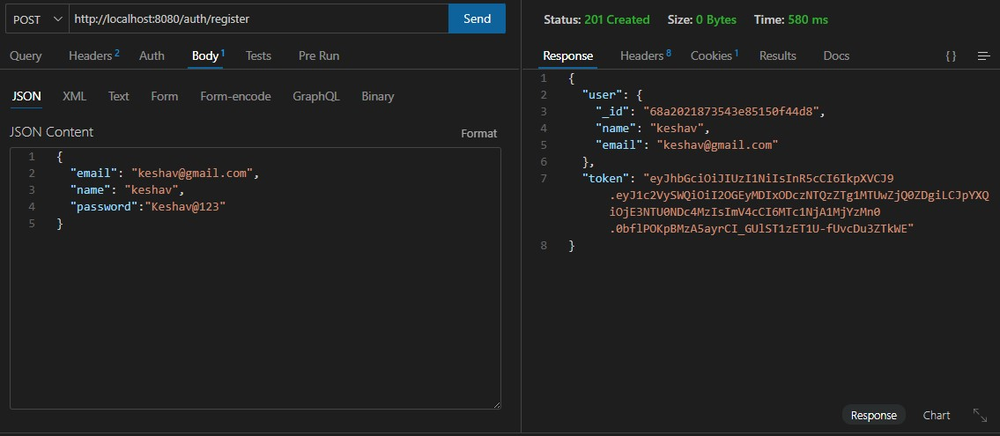

---

#### 2. **Login user**
`POST /auth/login`  
Authenticates the user and returns a JWT token.  

📸 *Example:*  
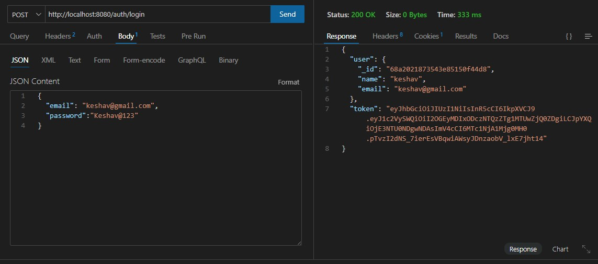

---

#### 3. **Get current user info**
`GET /auth/`  
Fetches details of the currently logged-in user (requires JWT).  

📸 *Example:*  
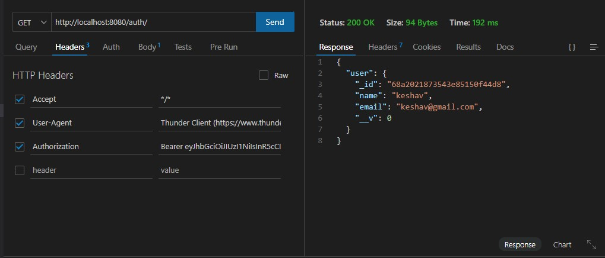

---

#### 4. **Logout user**
`GET /auth/logout`  
Logs out the current user and clears the session cookie.  

📸 *Example:*  
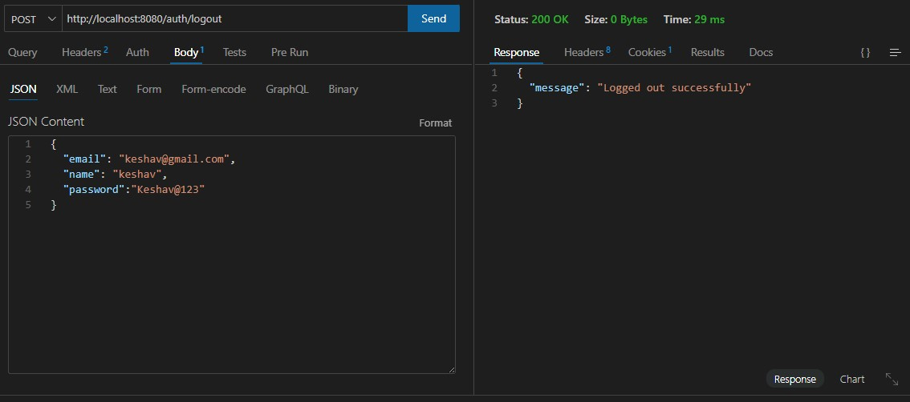

---

### 🛒 Cart Routes (`/cart`)

⚠️ All cart routes are **protected** and require a valid JWT token.

#### 1. **Add item to cart**
`POST /cart`  
Adds a product to the user’s cart.  

📸 *Example:*  
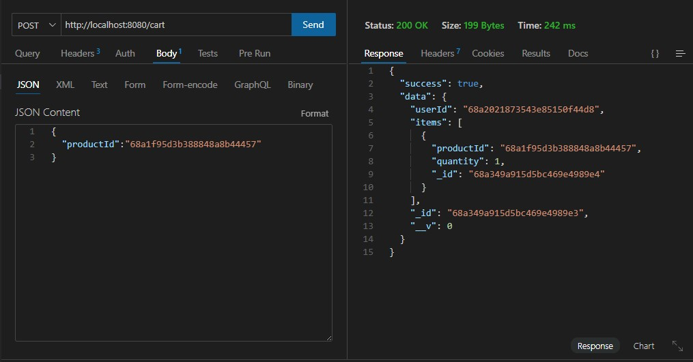

---

#### 2. **Get user’s cart**
`GET /cart`  
Retrieves all items in the user’s cart.  

📸 *Example:*  


---

#### 3. **Update item quantity or remove item**
`PUT /cart/:cartId`  
Updates the quantity of a cart item or removes it.  

📸 *Example:*  
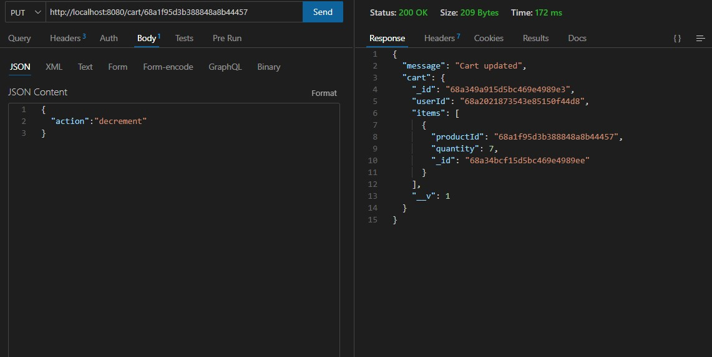

---

#### 4. **Delete all items from cart**
`DELETE /cart/clear`  
Removes all items from the user’s cart.  

📸 *Example:*  
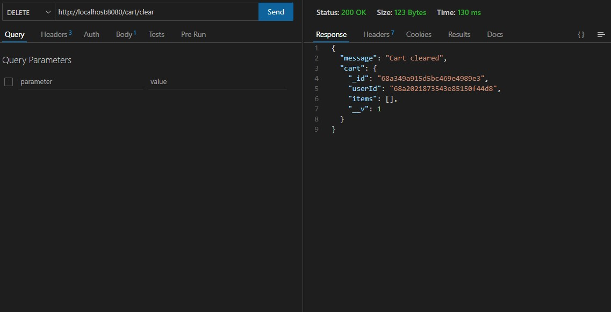

---

#### 5. **Delete a specific item from cart**
`DELETE /cart/:cartId`  
Deletes a single product from the cart.  

📸 *Example:*  
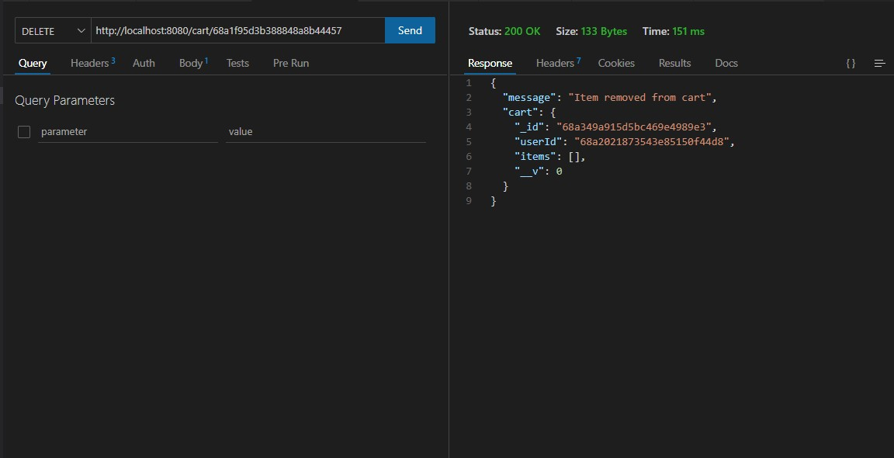

---

### 📦 Product Routes (`/products`)

#### 1. **Fetch all products**
`GET /products`  
Fetches a list of all available products.  

📸 *Example:*  
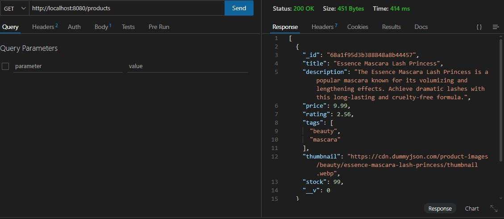

---

#### 2. **Fetch product by ID**
`GET /products/:id`  
Fetches product details using its ID.  

📸 *Example:*  
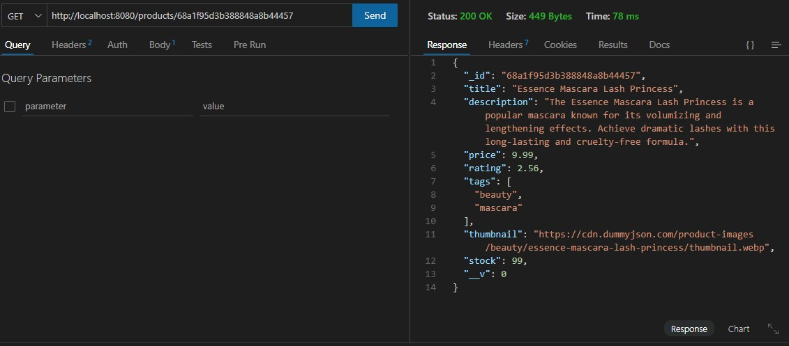

---

#### 3. **Add a new product**
`POST /products`  
Adds a new product to the catalog. *(Protect this route in production for admins only)*  

📸 *Example:*  
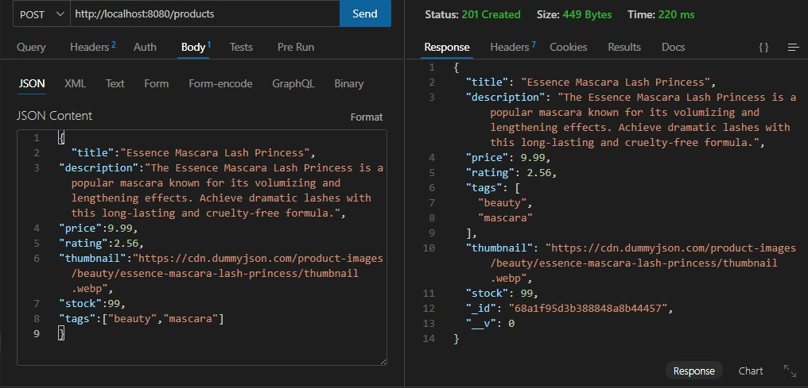

---

## 🧪 Testing

Use **Postman** or **Thunder Client** to test the APIs locally.  
For protected routes, attach the **JWT token** as a cookie.  


---

## 📊 Database Snapshots

Below are example screenshots of the database collections used in this project.

### 🗂️ Users Collection
Stores user details such as name, email, hashed password, and roles.

📸 *Example Screenshot:*  
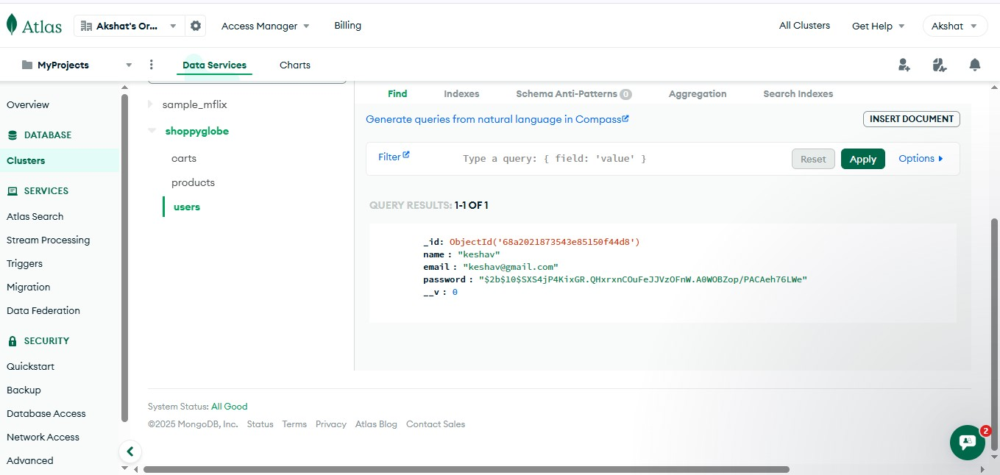

---

### 🛒 Carts Collection
Stores items added to the user’s cart, including product references and quantities.

📸 *Example Screenshot:*  
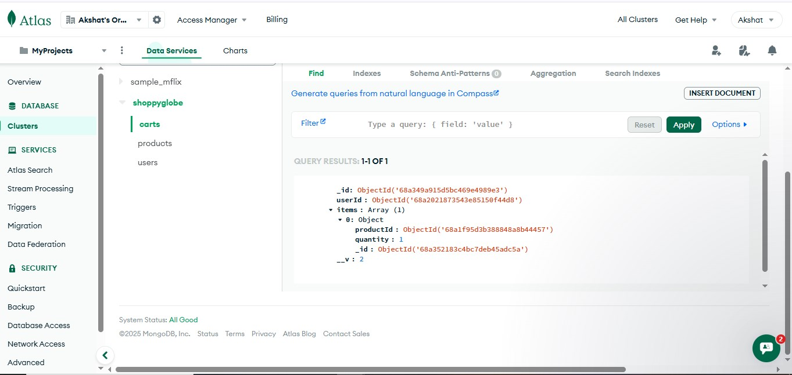

---

### 📦 Products Collection
Stores product details such as name, description, price, and stock.

📸 *Example Screenshot:*  
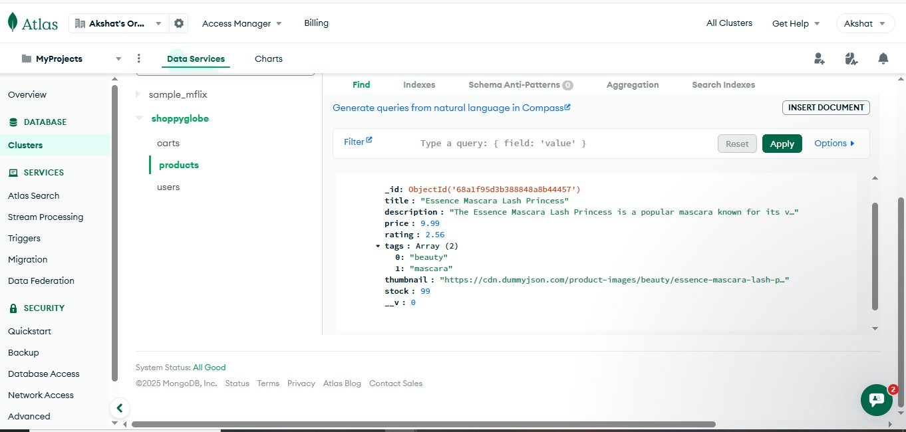


## 🧰 Future Improvements

- Role-based access control (Admin)
- Input validation with Joi or Zod
- Order and payment routes
- Rate limiting and security headers

---

## 👨‍💻 Author

**Akshat Singh**

📧 [akshatsinghrajput24@gmail.com](mailto:akshatsinghrajput24@gmail.com)  
🔗 [GitHub](https://github.com/Akshat24112001/ShoppyGlobeBackend)

---

## 📄 License

This project is licensed under the **MIT License**.
